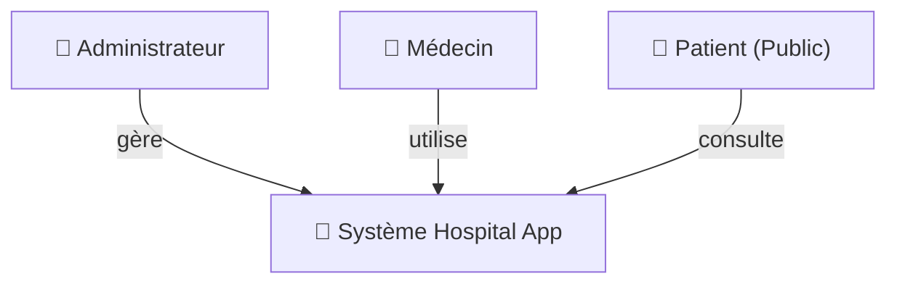
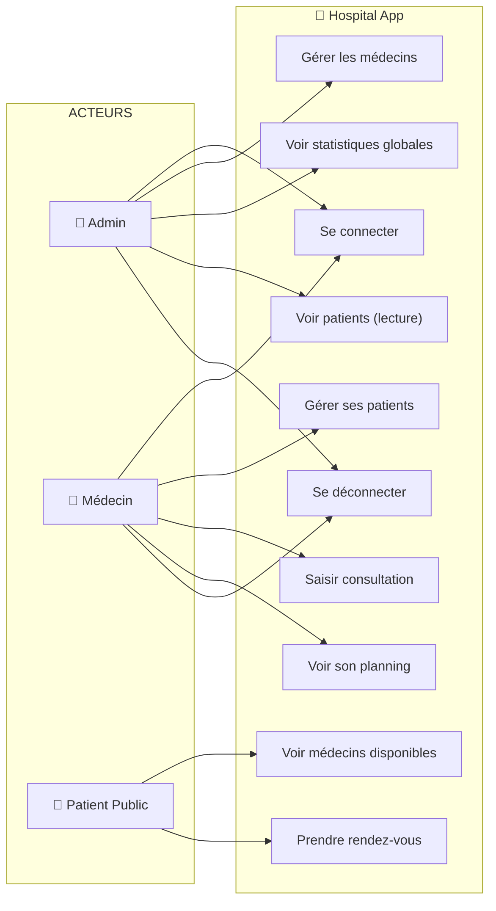
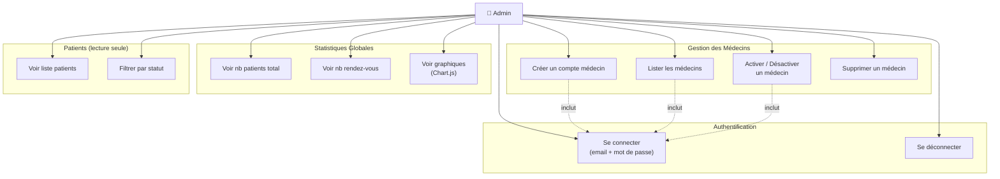
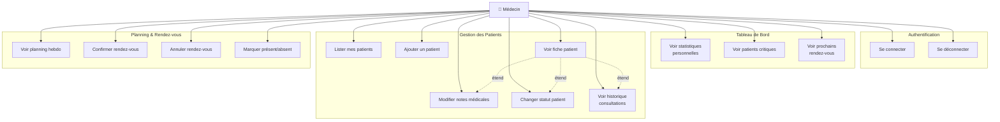
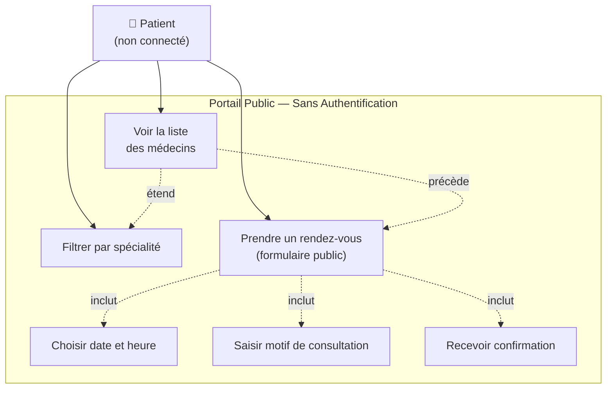
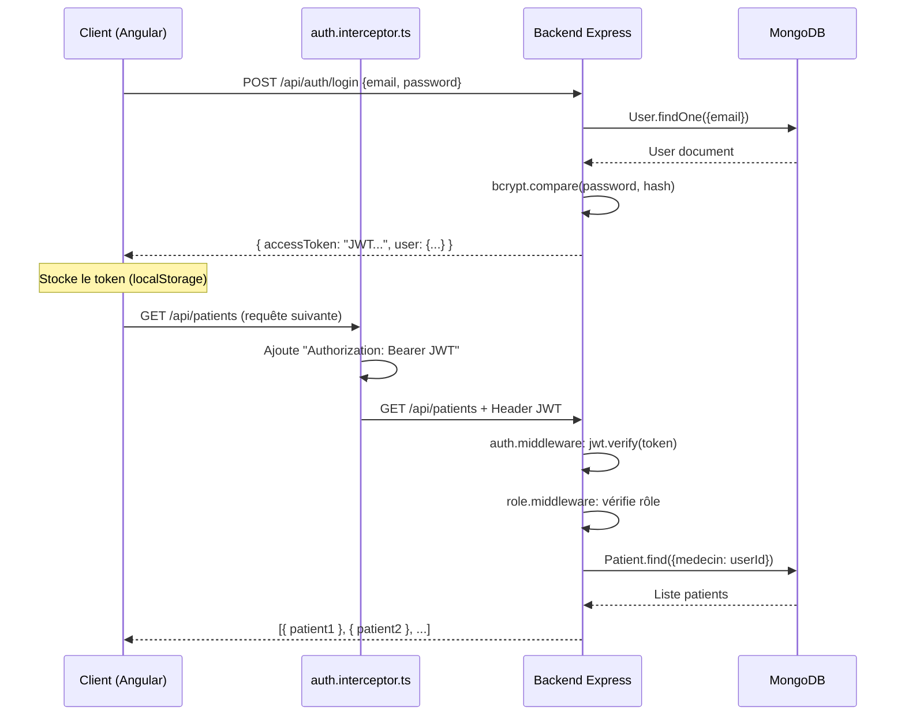

# Rapport d'Architecture — Application de Gestion Hospitalière

> **Projet :** Hospital App  
> **Stack :** Node.js / Express (Backend) · Angular 17+ (Frontend) · MongoDB (Base de données)  
> **Date :** Mai 2026

---

## Table des Matières

1. [Vue d'ensemble](#1-vue-densemble)
2. [Architecture Globale](#2-architecture-globale)
3. [Architecture Backend](#3-architecture-backend)
4. [Architecture Frontend](#4-architecture-frontend)
5. [Base de Données](#5-base-de-données)
6. [Outils et Technologies](#6-outils-et-technologies)
7. [Diagrammes UML — Cas d'Utilisation](#7-diagrammes-uml--cas-dutilisation)
   - [7.1 Cas d'utilisation global](#71-cas-dutilisation-global)
   - [7.2 Cas d'utilisation — Administrateur](#72-cas-dutilisation--administrateur)
   - [7.3 Cas d'utilisation — Médecin](#73-cas-dutilisation--médecin)
   - [7.4 Cas d'utilisation — Patient (accès public)](#74-cas-dutilisation--patient-accès-public)
8. [Flux d'Authentification](#8-flux-dauthentification)
9. [Sécurité](#9-sécurité)

---

## 1. Vue d'ensemble

L'application est une plateforme de gestion hospitalière à 3 rôles :

| Rôle | Accès |
|------|-------|
| **Admin** | Gestion des médecins, utilisateurs, statistiques globales |
| **Médecin** | Gestion de ses patients, consultations, planning de rendez-vous |
| **Patient** | Consultation publique : médecins disponibles, prise de rendez-vous |

L'architecture suit le pattern **MVC** côté backend et une architecture **Feature-based** côté frontend.

---

## 2. Architecture Globale

```
┌─────────────────────────────────────────────────────────┐
│                     NAVIGATEUR (Client)                  │
│   ┌──────────────────────────────────────────────────┐  │
│   │         Angular 17+ SPA — port 4200              │  │
│   │  Components · Services · Guards · Interceptors   │  │
│   └───────────────────────┬──────────────────────────┘  │
└───────────────────────────│─────────────────────────────┘
                            │  HTTP REST (JSON)
                            │  JWT Bearer Token
                ┌───────────▼───────────┐
                │  Express REST API     │
                │  Node.js — port 5000  │
                │  Middlewares · JWT    │
                └───────────┬───────────┘
                            │  Mongoose ODM
                ┌───────────▼───────────┐
                │      MongoDB          │
                │  localhost:27017      │
                │  hospital_db          │
                └───────────────────────┘
```

---

## 3. Architecture Backend

### Structure des dossiers

```
backend/
├── server.js                  # Point d'entrée — Express + MongoDB
├── .env                       # Variables d'environnement
└── src/
    ├── app.js                 # Configuration Express, CORS, routes
    ├── controllers/           # Logique métier (MVC — Controller)
    │   ├── auth.controller.js
    │   ├── consultation.controller.js
    │   ├── patient.controller.js
    │   ├── rendezVous.controller.js
    │   ├── stats.controller.js
    │   └── user.controller.js
    ├── middlewares/           # Pipeline de traitement des requêtes
    │   ├── auth.middleware.js    # Vérification JWT
    │   ├── role.middleware.js    # Contrôle d'accès RBAC
    │   └── error.handler.js     # Gestion centralisée des erreurs
    ├── models/                # Schémas Mongoose (MVC — Model)
    │   ├── User.js
    │   ├── Patient.js
    │   ├── ConsultationNote.js
    │   └── RendezVous.js
    ├── routes/                # Définition des endpoints REST
    │   ├── auth.routes.js
    │   ├── patient.routes.js
    │   ├── consultation.routes.js
    │   ├── rendezVous.routes.js
    │   ├── stats.routes.js
    │   ├── user.routes.js
    │   └── public.routes.js
    ├── services/              # Services métier (logique réutilisable)
    │   ├── auth.service.js
    │   ├── email.service.js
    │   └── user.service.js
    └── seed/
        └── seedData.js        # Données initiales MongoDB
```

### Pipeline d'une requête HTTP

```
HTTP Request
    │
    ▼
[CORS Middleware]
    │
    ▼
[express.json() Parser]
    │
    ▼
[auth.middleware.js]  ← Vérifie le token JWT
    │
    ▼
[role.middleware.js]  ← Vérifie le rôle (admin/médecin)
    │
    ▼
[Controller]          ← Logique métier, appel Service/Model
    │
    ▼
[Model (Mongoose)]    ← Requête MongoDB
    │
    ▼
HTTP Response (JSON)
```

### Endpoints REST principaux

| Méthode | Route | Accès | Description |
|---------|-------|-------|-------------|
| `POST` | `/api/auth/login` | Public | Connexion |
| `GET` | `/api/patients` | Médecin | Liste des patients |
| `POST` | `/api/patients` | Médecin | Créer un patient |
| `PUT` | `/api/patients/:id/notes` | Médecin | Mettre à jour notes |
| `GET` | `/api/rendezvous` | Médecin | Planning rendez-vous |
| `POST` | `/api/rendezvous` | Public | Prendre rendez-vous |
| `GET` | `/api/stats/medecin` | Médecin | Statistiques médecin |
| `GET` | `/api/stats/admin` | Admin | Statistiques globales |
| `GET` | `/api/users` | Admin | Liste des médecins |
| `POST` | `/api/users` | Admin | Créer un médecin |
| `GET` | `/api/public/medecins` | Public | Médecins disponibles |

---

## 4. Architecture Frontend

### Structure des dossiers

```
frontend/src/app/
├── app.config.ts              # Configuration Angular (providers, router)
├── app.routes.ts              # Définition des routes avec lazy loading
├── core/
│   ├── guards/
│   │   ├── auth.guard.ts      # Redirige vers /login si non connecté
│   │   └── role.guard.ts      # Redirige vers /forbidden selon le rôle
│   ├── interceptors/
│   │   ├── auth.interceptor.ts   # Injecte le JWT dans chaque requête
│   │   └── error.interceptor.ts  # Gestion globale des erreurs HTTP
│   ├── models/
│   │   ├── user.model.ts
│   │   ├── patient.model.ts
│   │   └── rendez-vous.model.ts
│   └── services/
│       ├── auth.service.ts       # Login, logout, token, profil
│       ├── patient.service.ts    # CRUD patients
│       ├── rendez-vous.service.ts
│       ├── stats.service.ts
│       └── user.service.ts
├── features/                  # Modules fonctionnels (lazy loaded)
│   ├── auth/
│   │   └── login/login.component.ts
│   ├── admin/
│   │   ├── admin-dashboard/
│   │   ├── medecins/
│   │   └── patients-readonly/
│   ├── medecin/
│   │   ├── medecin-dashboard/
│   │   ├── patients/
│   │   ├── fiche-patient/
│   │   └── planning/
│   └── public/
│       └── rendez-vous-public/
└── shared/
    └── components/
        ├── sidebar/           # Navigation latérale (admin/médecin)
        ├── stat-card/         # Carte de statistiques réutilisable
        ├── status-badge/      # Badge de statut patient
        └── rdv-status-badge/  # Badge de statut rendez-vous
```

### Routing avec Lazy Loading

```
/login                          → LoginComponent (public)
/admin
  /dashboard                    → AdminDashboardComponent (rôle: admin)
  /medecins                     → MedecinsComponent (rôle: admin)
  /patients                     → PatientsReadonlyComponent (rôle: admin)
/medecin
  /dashboard                    → MedecinDashboardComponent (rôle: medecin)
  /patients                     → PatientsComponent (rôle: medecin)
  /patients/:id                 → FichePatientComponent (rôle: medecin)
  /planning                     → PlanningComponent (rôle: medecin)
/rendez-vous                    → RendezVousPublicComponent (public)
/forbidden                      → ForbiddenComponent
/**                             → NotFoundComponent
```

### Flux de données Angular

```
HTTP Request
    │
    ▼
[auth.interceptor.ts]  ← Injecte "Authorization: Bearer <token>"
    │
    ▼
[Service (HttpClient)] ← Ex: PatientService.getPatients()
    │
    ▼
[Component (Signal)]   ← Met à jour le signal, re-render automatique
    │
    ▼
[Template HTML]        ← Affiche les données (@if, @for, pipes)
```

---

## 5. Base de Données

### Collections MongoDB

#### `users`
```json
{
  "_id": "ObjectId",
  "email": "String (unique)",
  "passwordHash": "String (bcrypt)",
  "role": "admin | medecin",
  "nom": "String",
  "prenom": "String",
  "specialite": "String (médecin)",
  "telephone": "String",
  "actif": "Boolean",
  "createdAt": "Date"
}
```

#### `patients`
```json
{
  "_id": "ObjectId",
  "nom": "String",
  "prenom": "String",
  "dateNaissance": "Date",
  "telephone": "String",
  "email": "String",
  "adresse": "String",
  "medecin": "ObjectId → users",
  "statut": "stable | en observation | critique | guéri",
  "notesMedicales": "String",
  "createdAt": "Date"
}
```

#### `consultationnotes`
```json
{
  "_id": "ObjectId",
  "patient": "ObjectId → patients",
  "medecin": "ObjectId → users",
  "date": "Date",
  "diagnostic": "String",
  "traitement": "String",
  "notes": "String",
  "statutPatient": "String",
  "createdAt": "Date"
}
```

#### `rendezvous`
```json
{
  "_id": "ObjectId",
  "patient": "ObjectId → patients",
  "medecin": "ObjectId → users",
  "date": "Date",
  "type": "consultation | urgence | suivi",
  "statut": "en attente | confirmé | annulé | présent | absent",
  "motif": "String",
  "priorite": "faible | moyen | élevé",
  "createdAt": "Date"
}
```

### Schéma relationnel

```
users (médecins/admins)
    │ 1
    │──────────────────┐
    │ N                │ N
patients          rendezvous
    │ 1
    │ N
consultationnotes
```

---

## 6. Outils et Technologies

### Backend

| Outil | Version | Rôle |
|-------|---------|------|
| **Node.js** | v22.x | Runtime JavaScript serveur |
| **Express.js** | ^4.x | Framework HTTP REST |
| **Mongoose** | ^8.x | ODM MongoDB — modélisation des données |
| **MongoDB** | 7.x | Base de données NoSQL orientée documents |
| **bcryptjs** | ^2.x | Hachage des mots de passe |
| **jsonwebtoken** | ^9.x | Génération et vérification des tokens JWT |
| **express-validator** | ^7.x | Validation des données entrantes |
| **nodemailer** | ^6.x | Envoi d'emails (notifications) |
| **nodemon** | ^3.x | Rechargement automatique en développement |
| **dotenv** | ^16.x | Gestion des variables d'environnement |
| **cors** | ^2.x | Gestion du Cross-Origin Resource Sharing |

### Frontend

| Outil | Version | Rôle |
|-------|---------|------|
| **Angular** | v17+ | Framework SPA (Standalone Components) |
| **TypeScript** | ^5.x | Typage statique JavaScript |
| **TailwindCSS** | ^3.x | Framework CSS utilitaire |
| **RxJS** | ^7.x | Programmation réactive (Observables) |
| **Angular Signals** | v17 | Réactivité fine sans NgZone |
| **Angular Router** | v17 | Navigation SPA avec lazy loading |
| **ng2-charts** | ^6.x | Graphiques Chart.js intégrés Angular |
| **Chart.js** | ^4.x | Rendu des graphiques (camemberts, barres) |

### Outils de développement

| Outil | Rôle |
|-------|------|
| **npm** | Gestionnaire de paquets |
| **Angular CLI** | Génération et build Angular |
| **ESBuild** (via NG CLI) | Compilation rapide Angular |
| **MongoDB Compass** | Interface graphique MongoDB |

---

## 7. Diagrammes UML — Cas d'Utilisation

### 7.1 Cas d'utilisation global





---

### 7.2 Cas d'utilisation — Administrateur



---

### 7.3 Cas d'utilisation — Médecin



---

### 7.4 Cas d'utilisation — Patient (accès public)



---

## 8. Flux d'Authentification



---

## 9. Sécurité

| Mesure | Implémentation |
|--------|----------------|
| **Authentification** | JWT (JSON Web Token) avec expiration configurable |
| **Hachage mots de passe** | bcryptjs (coût 12) |
| **Autorisation RBAC** | Middleware `role.middleware.js` par route |
| **Validation des entrées** | `express-validator` sur toutes les routes POST/PUT |
| **CORS** | Configuration stricte avec origine autorisée |
| **Variables sensibles** | `.env` (JWT_SECRET, MONGO_URI — jamais committés) |
| **Protection brute-force** | Délai d'erreur constant (pas d'info sur l'existence du compte) |
